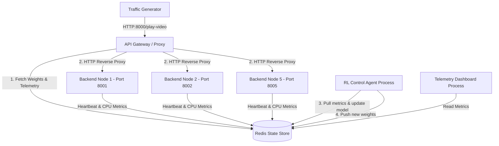

# Distributed AI-Driven Load Balancer (Redis + FastAPI Microservices)
[](https://www.python.org/)
[](https://fastapi.tiangolo.com/)
[](https://redis.io/)
[](https://www.docker.com/)

A high-performance, SDE-focused prototype of an **AI-Driven Asynchronous Load Balancer** implemented as a **distributed microservice cluster**. The system decouples synchronous reverse proxy routing (Data Plane) from asynchronous Reinforcement Learning optimization (Control Plane), communicating entirely over HTTP networks and a shared Redis database.

---

## 🏗️ System Architecture

Instead of in-memory simulations, this project runs **six concurrent, independent web services** linked via a centralized Redis cache and local HTTP routing:



1.  **API Gateway Proxy (Port 8000)**: A FastAPI-based reverse proxy that reads routing weights from Redis in **< 0.1ms**, checks safety guardrails, and forwards the incoming client requests to backend nodes using a pooled `httpx.AsyncClient` HTTP connection pool.
2.  **Backend Microservice Nodes (Ports 8001–8005)**: Five separate FastAPI processes representing backend servers. They handle requests asynchronously, monitor their own CPU load (via `psutil`), and run a background task reporting their heartbeat metrics back to Redis every 100ms.
3.  **RL Control Agent Process**: An independent control plane worker that polls traffic feedback from Redis, performs Bayesian updates on a Linear Thompson Sampling (LinTS) Contextual Bandit model, and writes updated routing weights back to Redis every 150ms.
4.  **Redis State Cache**: Bridges all independent OS processes (gateway, agent, nodes) using structured key-value stores:
    *   `rl:routing_weights`: JSON serialized probability weights array.
    *   `node:{idx}:cpu` and `node:{idx}:queue`: Active heartbeats.
    *   `window:node:{idx}:*`: Temporary counters storing real-time feedback for the RL agent.

---

## 🛡️ Safety Guardrails & Fallbacks

*   **Heartbeat Node Detection**: If a backend container or process dies, its heartbeat key in Redis expires. The gateway detects this within 2.0s, marks the node CPU to 100% (overloaded), and stops sending traffic to it.
*   **Action Masking**: If a node's CPU exceeds **85.0%**, the gateway immediately overrides its weight to **0.0%** and renormalizes traffic distribution.
*   **Staleness Circuit Breaker**: If the control plane halts (cache updates $> 1.0$s stale), the gateway trips a circuit breaker and automatically falls back to **Least Connections routing** (using active node queues reported in Redis).
*   **Zero-Dependency Local Fallback**: If a connection to a real Redis server fails on startup, the system automatically falls back to an in-memory, thread-safe `MockRedis` engine, ensuring the project remains runnable without any local Redis installations.

---

## 🧮 Reinforcement Learning (Linear Thompson Sampling)

The Control Plane optimizes routing weights based on a contextual multi-armed bandit.

*   **Context vector ($x_{t,i}$)**: `[Bias, CPU/100, Queue/20, P99/200, GlobalRate/150, d/dt(Rate)/50]`
*   **Reward ($r_{t,i}$)**: Capped penalty calculated from node performance:
    $$r_{t,i} = - \left( 1.0 \cdot \left(\frac{\text{P99}_i}{200}\right) + 5.0 \cdot \text{Error-Rate}_i + 10.0 \cdot \text{SLA-Breach-Rate}_i \right)$$
*   **Decision**: Samples parameters $\tilde{\theta}_i$ from the posterior Gaussian distribution $\mathcal{N}(\hat{\theta}_i, v^2 B_i^{-1})$ and outputs weights using Softmax:
    $$w_i = \frac{e^{\text{Score}_i / \tau}}{\sum_j e^{\text{Score}_j / \tau}}$$

Learned belief matrices $B_i$ and vectors $f_i$ are serialized to `model_checkpoint.npz` on clean shutdown and restored automatically on startup.

---

## 📁 Project Structure

```
.
├── Dockerfile                 # Multi-stage production container build
├── docker-compose.yml         # Container orchestration network
├── requirements.txt           # Python dependencies
├── run.sh                     # Launch and local installation script
├── tests/
│   └── test_load_balancer.py  # Automation unit and integration testing suite
└── src/
    ├── config.py              # Ports, hosts, and Redis configuration settings
    ├── shared_state.py        # Redis state driver & MockRedis fallback
    ├── backend_node.py        # Microservice node server (fastapi)
    ├── gateway.py             # Reverse HTTP Proxy (fastapi + connection pool)
    ├── agent.py               # Thompson Sampling RL Control loop
    ├── dashboard.py           # ANSI terminal telemetry dashboard
    └── main.py                # Multi-process orchestrator (subprocess launcher)
```

---

## 🚀 Setup & Execution

### Option 1: Local Launch (No Docker Required)
The local runner will install requirements and spawn **six local python processes** representing the microservice cluster:
```bash
chmod +x run.sh
./run.sh
```
*Note: If a local Redis port (6379) is not open, the system prints a warning and automatically falls back to the in-memory mock cache.*

### Option 2: Docker Compose (Fully Containerized)
Build and run the entire cluster in containerized isolation on a private Docker bridge network:
```bash
docker compose up --build
```
This spins up:
*   A `redis` container.
*   5 distinct `rl-node` backend service containers.
*   An `rl-gateway-orchestrator` container executing the gateway, agent, generator, and mounting a interactive TTY for the telemetry console!

---

## 🧪 Automated Testing
Run the automated testing suite to verify code quality and component boundaries:
```bash
source venv/bin/activate
PYTHONPATH=. pytest -v
```
This tests MockRedis locks, node heartbeats, action masking overrides, and Thompson Sampling math equations in a deterministic, sandboxed environment.
