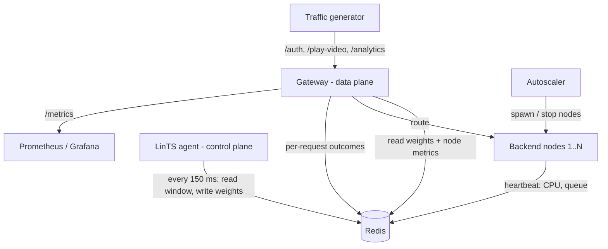

# Adaptive Load Balancer: Learned Routing and Multi-Gateway Herding

This repository has two parts:

1. **`src/` — a working load-balancer prototype.** A FastAPI gateway routes to
   backend services using one of five strategies, including a Linear Thompson
   Sampling (LinTS) contextual bandit that runs as a separate control-plane
   process and publishes routing weights through Redis.
2. **`research/` — a study of what happens when many gateways learn at once.**
   Production routing tiers run many gateway replicas that decide independently
   from the same slightly stale shared state. `research/` is a discrete-event
   simulator and experiment suite that measures when that makes learned routers
   *herd* (stampede onto the same backend), and which cheap changes prevent it.
   Results and write-up: **[research/README.md](research/README.md)**.

---

## Honest summary of results

- **Single gateway (`python src/benchmark.py`, [benchmark_results.md](benchmark_results.md)).**
  With the CPU guardrail on, all strategies look similar because the guardrail
  (not the learning) removes overloaded nodes. With the guardrail **off**, the
  LinTS agent is clearly *worse* than Least Connections at higher load and
  under a degraded node. The adaptive agent is not a free win.
- **Single gateway, in numbers.** At 500 RPS with the guardrail off, LinTS has
  a P99 of 786 ms against 99 ms for Least Connections. With a degraded node it is
  817 ms against 699 ms, with 5.7% errors against 1.6%.
- **Many gateways (`research/`).** Stale shared state makes learned routers herd,
  worse than classic Join-Shortest-Queue. With 16 gateways and 50 ms stale state,
  learned greedy routing has a P99 of 2.9 s against 0.8 s for JSQ. Two cheap changes
  fix most of it:
  - **P2C over learned scores:** pick two random backends, then choose the one with the
    lower predicted latency. P99 is 152 ms, and it stays flat from 1 to 64 gateways.
  - **Local correction:** each gateway counts the requests it has sent itself since
    the last state update.

  See [research/README.md](research/README.md).

---

## Architecture of the prototype



- **Gateway (`src/gateway.py`).** Reads routing weights and node metrics (one
  batched `MGET`), applies the CPU mask, picks a backend with the active
  strategy, proxies the request, and records the outcome (one pipelined write).
  Strategies: `lin_ts`, `least_conn`, `p2c`, `round_robin`, `weighted_round_robin`,
  switchable at runtime via `POST /strategy`.
- **Agent (`src/agent.py`).** Every control interval it reads the per-node
  window of completed requests, updates one Bayesian linear model per node, samples
  scores, and publishes softmax weights. It learns from windowed feedback only, so
  each request outcome is counted once.
- **Fleet discovery (`src/shared_state.py`).** The live fleet size is derived from
  node heartbeats (between `num_instances` and `max_instances` in `config.yaml`), so
  nodes started by the autoscaler receive traffic and stopped nodes are dropped.
- **Guardrails.** CPU mask (weight 0 above 85% CPU, applied equally to every
  strategy; `RoutingEngine(apply_cpu_mask=False)` disables it for experiments),
  a staleness circuit breaker (falls back to least connections if the agent stops
  publishing for > 1 s), retry on another node when a request fails, and shedding
  of low-priority endpoints when average CPU > 80%.
- **Explainability.** `GET /explain-routing` shows each node's weight, CPU,
  queue and recent P99, and whether it is masked.

### LinTS model

Context per node: $\mathbf{x}_i = [1, \text{CPU}_i/100, \text{Queue}_i/20, \text{P99}_i/200, \text{Rate}/150, \Delta\text{Rate}/50]$.
Reward per window: $r_i = -(\text{P99}_i/200 + 5\,\text{Err}_i + 10\,\text{SLA}_i)$.
Update: $\mathbf{B}_i \mathrel{+}= \mathbf{x}\mathbf{x}^\top$, $\mathbf{f}_i \mathrel{+}= r\mathbf{x}$, $\hat\theta_i = \mathbf{B}_i^{-1}\mathbf{f}_i$;
sample $\tilde\theta_i \sim \mathcal{N}(\hat\theta_i, v^2\mathbf{B}_i^{-1})$; weights $w = \mathrm{softmax}(\mathbf{x}_i^\top\tilde\theta_i/\tau)$.

### Known limitations

- The Redis client is synchronous. The gateway does about three Redis round trips
  per request on the event loop; per-request overhead has not been measured.
- Geo-routing is informational only: the estimated cross-region penalty is
  reported in `X-Decision-Reason` but is never added to measured latency.
- Without a reachable Redis, each process falls back to its own in-memory store
  and **no state is shared** between gateway, agent and backends (a warning is
  logged). Use Docker Compose or a local `redis-server` for the full system.
- Backend "CPU" is simulated from queue depth, not measured.

---

## Quick start

```bash
pip install -r requirements.txt

# Full system (needs Redis on localhost:6379, e.g. `redis-server --daemonize yes`)
python src/main.py

# Or with containers
docker compose up --build

# Tests
PYTHONPATH=. pytest -q

# Single-gateway benchmark (mean ± 95% CI over seeds, CPU mask on and off)
python src/benchmark.py --seeds 5

# Research experiments (multi-gateway herding)
pip install -r research/requirements.txt
python -m research.run all          # simulator grid, ~35 min on 4 cores; --quick for a smoke test
python -m research.analyze          # figures + research/results/summary.md
python -m research.realsys          # real-system grid (needs Redis), ~40-45 h, resumable
```

Useful endpoints on `:8000`: `/play-video`, `/auth`, `/analytics`,
`/explain-routing`, `/metrics`, `POST /strategy`, `POST /chaos/inject?node_idx=0`
(body `{"fault_type": "cpu_spike"}`), `POST /chaos/clear`.

---

## Repository layout

```
src/                     prototype load balancer
  gateway.py             reverse proxy, routing, QoS, explainability
  agent.py               LinTS control plane
  routing_strategies.py  the five strategies + CPU mask
  shared_state.py        Redis state, fleet discovery, feedback windows
  backend_node.py        simulated backend service
  autoscaler.py          scales backend processes on CPU
  benchmark.py           single-gateway simulation benchmark
research/                multi-gateway herding study
  sim.py                 discrete-event simulator (K gateways, N servers, stale state)
  policies.py            heuristic and learned dispatch policies
  run.py                 experiment grids -> results/*.csv
  analyze.py             figures/ and results/summary.md
  README.md              research question, method, findings
tests/                   unit tests for both parts
```

## License

MIT — see [LICENSE](LICENSE).
