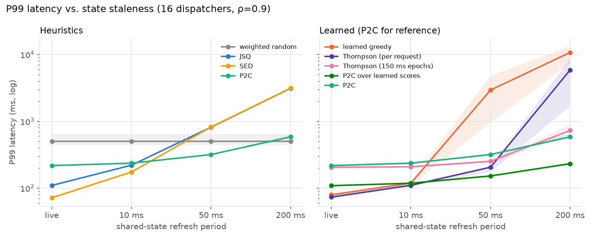
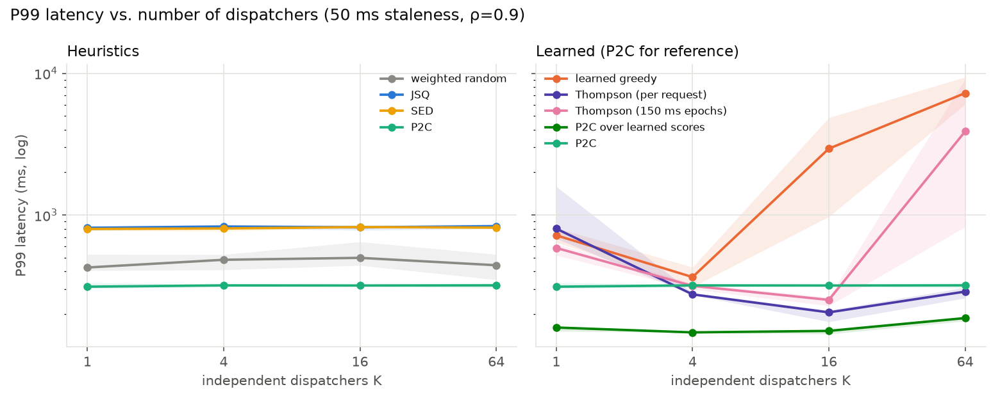
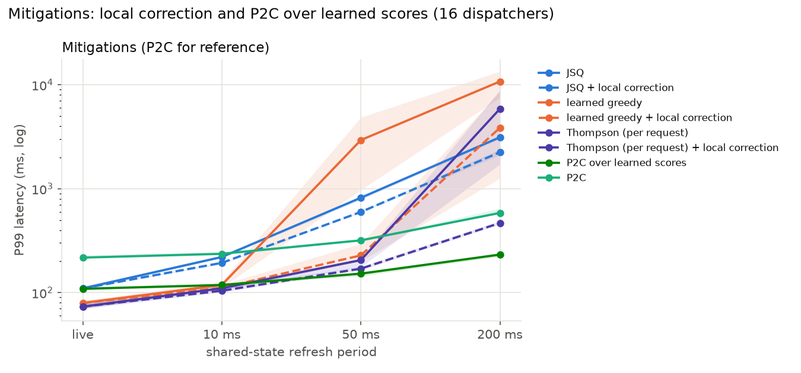
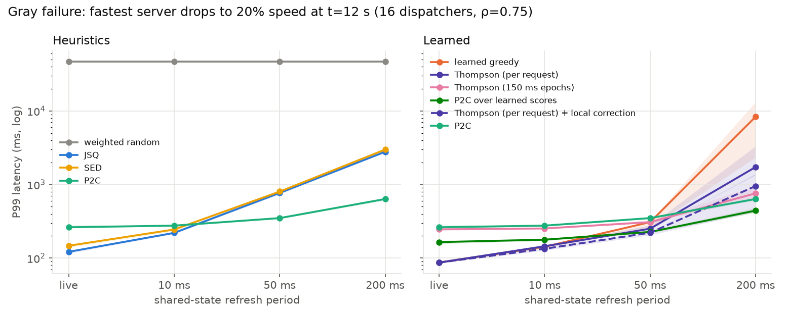

# Do Learned Load Balancers Herd?

**Question.** Production routing tiers run many gateway replicas that decide
independently from the same, slightly stale shared view of backend load. Classic
queueing work shows that this makes Join-Shortest-Queue *herd*: every dispatcher
sees the same "best" server and they stampede onto it. Learned routers (bandits,
latency-model-based scoring) are increasingly used in this layer. **Do they herd
too, how badly, and what cheap change prevents it?**

**Short answer (simulation, 10 seeds per point).**

1. Learned greedy routing herds *worse* than classic JSQ. With 16 gateways and
   50 ms stale state its P99 is 2.9 s vs. 0.8 s for JSQ; at 200 ms it is 10.8 s.
2. Per-request Thompson sampling helps a lot at moderate staleness (P99 206 ms at
   50 ms), but it collapses at 200 ms (5.9 s). Its protection comes mainly from
   dispatchers *disagreeing with each other*: with a single gateway it is far worse
   (802 ms) than with 16 (206 ms).
3. **P2C over learned scores** (sample two backends at random, send to the one
   with the lower predicted latency) is the most robust policy we tested:
   152 ms at 50 ms and 232 ms at 200 ms staleness, nearly flat from 1 to 64 gateways,
   and best under a gray failure once state is stale. The cost is about 35 ms of
   extra P99 when state is perfectly fresh.
4. **Local correction** (each gateway counts what it itself sent since the last
   snapshot) fixes herding *within* one gateway but not *across* many: learned greedy +
   local correction goes from 103 ms at K=1 to 7.6 s at K=64.
5. The production agent's design (sample weights every 150 ms control interval, route by
   those weights in between) adds its own staleness: with perfectly fresh state
   its P99 is 205 ms vs. 73 ms for per-request Thompson sampling, and it rises
   monotonically with the interval (138 ms at 10 ms to 837 ms at 500 ms).

These are simulation results under stated assumptions (below), not production
measurements.

---

## Setup

`research/sim.py` is a discrete-event simulator:

| Component | Model |
|---|---|
| Servers | 8 FIFO single-server queues, exponential service, rates 200/200/150/150/100/100/50/50 req/s (total 1000) |
| Arrivals | Poisson, rate ρ × 1000 (ρ = 0.9 unless stated), each assigned uniformly to one of K dispatchers |
| Shared state | a snapshot of all queue lengths published every Δ seconds (Δ = 0 means live); all dispatchers read the same snapshot |
| Feedback | each dispatcher sees only the latency of its own requests, when they complete |
| Gray failure | from t = 12 s the fastest server runs at 20% speed; nothing announces it. Run at ρ = 0.75 so the system stays stable (89% utilisation after the failure) |
| Runs | 30 s simulated, first 3 s discarded, 10 seeds per configuration |

The simulator is validated against M/M/1 theory, and it reproduces the classic
result that stale JSQ herds while P2C does not (`tests/test_research_sim.py`).

**Policies** (`research/policies.py`). *Heuristics:* capacity-weighted random, JSQ,
SED (shortest expected delay, using *nominal* server speeds), P2C. *Learned:* each
dispatcher fits one discounted Bayesian linear model per server,
latency ≈ a + b·queue, from its own completions, then routes by greedy argmin
of the posterior mean, per-request Thompson sampling (TS), TS with softmax weights
recomputed every 150 ms (`ts_epoch`, mirroring `src/agent.py`), or P2C over the
posterior mean (`p2c_learned`). A `+lc` suffix adds local correction.

**Metrics.** P99 latency; **herding index** = Fano factor (variance/mean) of
per-server arrival counts in 50 ms bins. Independent random routing gives ≈ 1, and
a stampede gives ≫ 1. Tail latencies are heavy-tailed across seeds (herding episodes
cause multi-second outliers), so every number is the **median over seeds with the
interquartile range (IQR)**.

---

## Results

All tables are in [`results/summary.md`](results/summary.md), with raw per-run data in
`results/*.csv`.

### 1. Stale state makes learned routers herd, badly



P99 latency (ms), 16 dispatchers, ρ = 0.9:

| policy | live | 10 ms | 50 ms | 200 ms |
|:---|---:|---:|---:|---:|
| JSQ | 110 | 220 | 819 | 3,129 |
| SED | 72 | 174 | 823 | 3,143 |
| P2C | 217 | 236 | 318 | 585 |
| learned greedy | 79 | 119 | 2,941 | 10,774 |
| Thompson (per request) | 73 | 110 | 206 | 5,878 |
| Thompson (150 ms epochs) | 205 | 208 | 252 | 731 |
| **P2C over learned scores** | 109 | 118 | **152** | **232** |

With live state, learned greedy and TS match the best heuristic (SED, which is
told the true server speeds); P2C over learned scores pays about 35 ms for its randomisation. From 50 ms of staleness onwards, argmin-style
policies (JSQ, SED, greedy) herd. The herding index confirms it's a stampede, not
just slow servers: at 50 ms it is 30.6 for JSQ, 37.2 for SED, 9.1 for greedy and 8.0
for TS, against 2.4 for P2C and 2.0 for P2C over learned scores
([figure 3](figures/fig3_herding_vs_staleness.png)).

### 2. More gateways: randomised choices hold up, argmin collapses



P99 (ms) at 50 ms staleness:

| policy | K=1 | K=4 | K=16 | K=64 |
|:---|---:|---:|---:|---:|
| learned greedy | 719 | 365 | 2,941 | 7,246 |
| Thompson (per request) | 802 | 276 | 206 | 288 |
| Thompson (150 ms epochs) | 586 | 316 | 252 | 3,889 |
| P2C over learned scores | 161 | 149 | 152 | 188 |
| learned greedy + local correction | 103 | 134 | 228 | 7,569 |
| Thompson + local correction | 102 | 136 | 170 | 258 |

Two effects are visible:
- **Within one gateway, herding is a matter of time.** A single gateway sends
  about 45 requests per 50 ms snapshot to the same argmin. Local correction removes
  this (greedy 719 → 103 ms at K=1).
- **Across gateways, herding comes from agreement.** Local correction cannot see
  other gateways' sends, so greedy + local correction collapses at K=64. Per-request
  TS *improves* from K=1 to K=16. Independent posteriors, each trained on a different
  slice of traffic, disagree about which server is best, and that decorrelates the
  gateways. Per-request sampling noise alone (K=1) is not enough.

### 3. Mitigations



Local correction helps every policy at small K and TS at every K tested
(Thompson + local correction: 170 ms at 50 ms, 468 ms at 200 ms). P2C over learned scores
is the most robust overall and needs no coordination or extra state.

### 4. Gray failure: learning helps, as long as it doesn't herd



P99 (ms), 16 dispatchers, ρ = 0.75, fastest server drops to 20% speed:

| policy | live | 10 ms | 50 ms | 200 ms |
|:---|---:|---:|---:|---:|
| JSQ | 122 | 220 | 770 | 2,790 |
| SED (nominal speeds) | 147 | 245 | 802 | 2,990 |
| P2C | 262 | 276 | 350 | 636 |
| learned greedy | 87 | 142 | 308 | 8,360 |
| Thompson + local correction | 87 | 134 | **221** | 954 |
| P2C over learned scores | 165 | 178 | 227 | **442** |

Heuristics that trust nominal speeds (SED) keep sending traffic to the degraded server.
Learned greedy and TS notice the slowdown from latency alone and beat every heuristic
with live or 10 ms state. Capacity-weighted random is unstable in this scenario: it
keeps sending the degraded server 20% of the traffic, about 150 req/s against 40 req/s
of capacity, so its P99 of about 46 s is off the chart.

### 5. The control interval is a hidden source of staleness

`ts_epoch` P99 (ms), K=16, against the weight-recompute interval:

| state staleness | 10 ms | 50 ms | 150 ms | 500 ms |
|:---|---:|---:|---:|---:|
| live | 138 | 149 | 205 | 837 |
| 50 ms | 158 | 173 | 252 | 1,069 |

Publishing weights on a timer, as `src/agent.py` does, is itself a staleness knob.
Even with live backend state, a 150 ms interval costs about 130 ms of P99 compared
with deciding per request.

### 6. Load sweep

Across ρ = 0.5 to 0.95 (K=16, 50 ms staleness), P2C over learned scores has the lowest
P99 from ρ = 0.7 upwards and is within 3 ms of the best at ρ = 0.5 (67 → 188 ms overall). Learned greedy is unstable at ρ = 0.9 and 0.95.
See [figure 6](figures/fig6_load.png) and the summary tables.

---

## Hyperparameters and fairness

- The learned policies share one model (prior λ = 1, noise σ² = 1, discount γ = 0.995,
  features [1, queue length]).
- `ts_epoch`'s softmax temperature (5) was the best of {0.5, 2, 5, 20} **on the same
  scenario family** we report on. This favours `ts_epoch`, and it still loses to the
  per-request policies.
- TS exploration scale (1, 3, 10, 30) and discount γ (0.98, 0.995, 0.999) change the
  picture little. Greedy is highly variable at 50 ms whatever γ is.
  See the sensitivity table in `results/summary.md` (`python -m research.run tuning`).

## Limitations (read before citing any number)

- **Simulation only.** FIFO single-server exponential queues, Poisson arrivals, and a
  single 8-server fleet. Real services have multi-core servers, heavy-tailed service
  times and bursty traffic.
- **Synchronised snapshots.** All gateways refresh at the same instant. Real
  replicas poll at different phases, which may itself reduce herding. This should be
  an explicit experiment.
- **A simple learned model** (queue length → latency). Richer context could change
  the ranking of the learned policies.
- **Missing baselines.** Prequal-style probing (NSDI 2024) and C3 (NSDI 2015) are
  the natural modern baselines and are not implemented yet.
- **Related work not yet checked in full.** Multi-dispatcher load balancing with stale
  information and multi-player bandits are both established areas. A literature review
  is needed before claiming novelty.

## Next steps toward a workshop paper

1. Desynchronised snapshot phases, and per-gateway staleness.
2. Trace-driven arrivals (e.g. the Azure Functions traces) and heavy-tailed service times.
3. Prequal and C3 baselines.
4. Validation on the real prototype: run K gateway processes from `src/` against the
   same Redis and compare with the simulator.
5. A mean-field or fluid model explaining why P2C over learned scores keeps
   herding bounded.
6. The LLM-serving variant: prefix-cache affinity against load, where herding onto
   cache-warm replicas is already reported in practice.

## Reproduce

```bash
pip install -r requirements.txt -r research/requirements.txt
python -m research.run all       # ~8 min on 4 cores (main grid ~5.5 min)
python -m research.analyze       # figures/ + results/summary.md
PYTHONPATH=. pytest -q tests/test_research_sim.py
```
